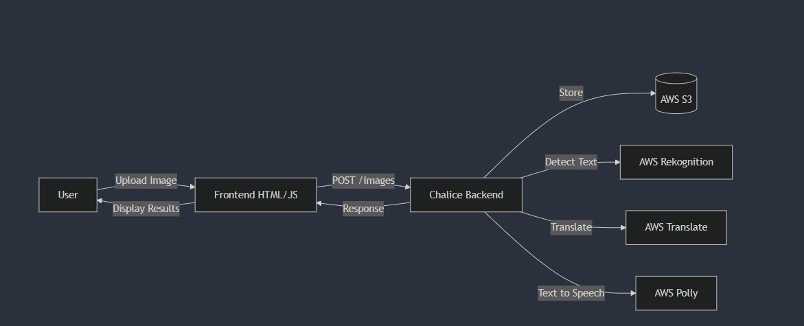
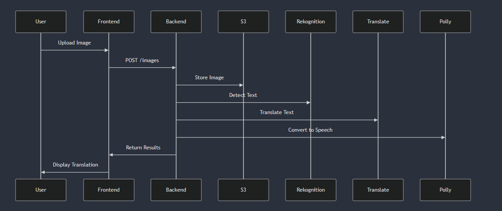
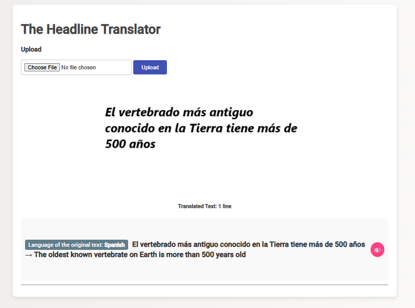

# Cloud Machine AI Learning Applications

This repository contains two AWS Chalice applications designed to showcase machine learning and cloud capabilities on AWS:

- **ObjectDetector:** An application that extracts images from S3, uses AWS Rekognition to detect objects, and provides a simple web interface to display the results.
- **PictorialTranslator:** An application that uploads images, extracts text using AWS Rekognition, translates the detected text with AWS Translate, and synthesizes speech using AWS Polly. It also offers a web interface for user interactions.

Each application is self-contained with its own capabilities and front-end components, making them easy to deploy and use independently.

## Diagramas y Capturas

Author: Renee Vera
